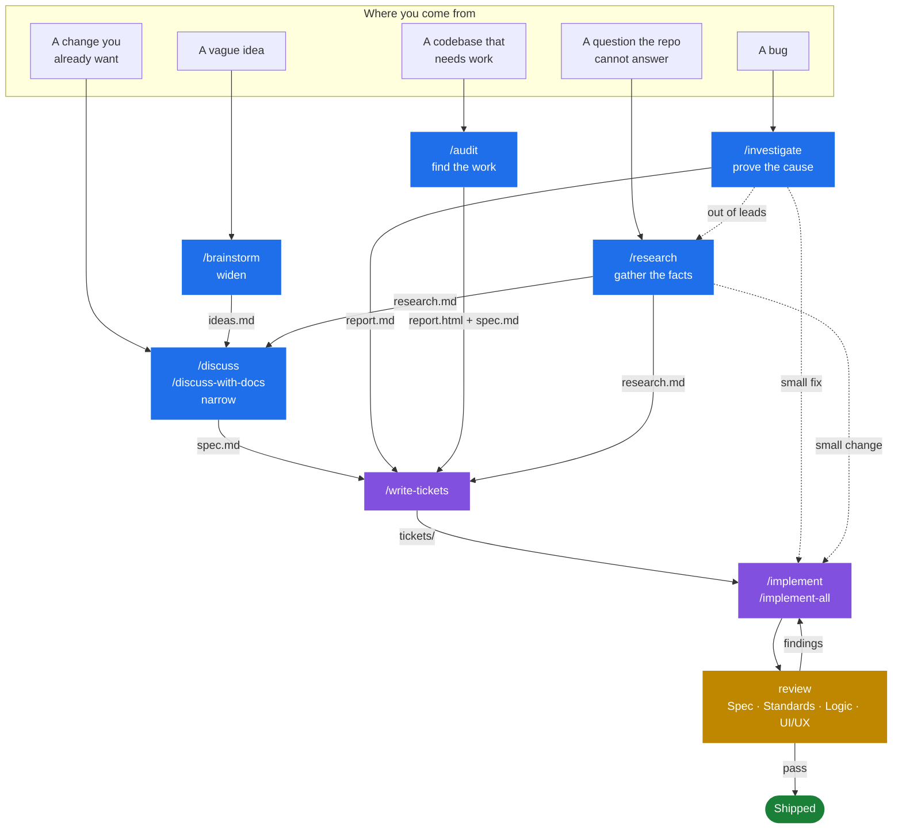
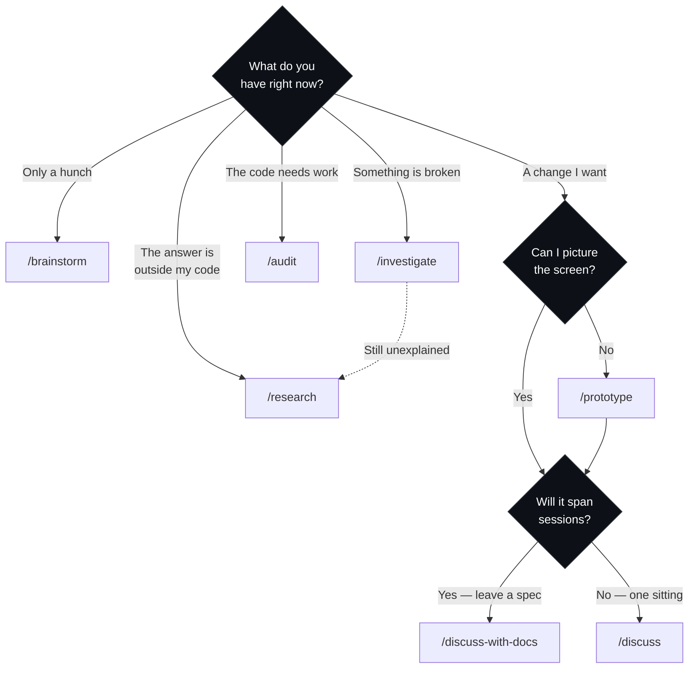
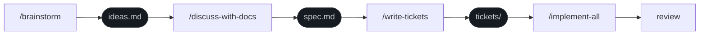
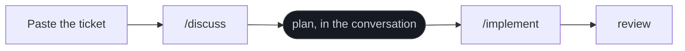
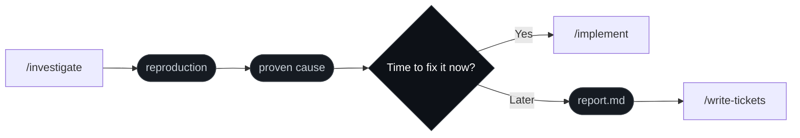
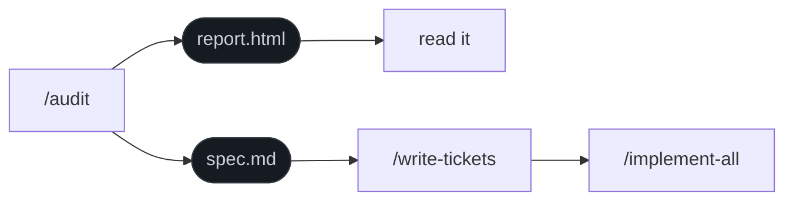
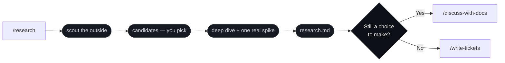

<div align="center">

# Skills

**A workflow for coding agents that asks before it builds.**

Twenty-one skills that take you from a vague idea to reviewed, shipped code — one decision at a time.

[](LICENSE)
[](https://github.com/NickDabizaz/skills/tags)
[](#skill-reference)

```bash
npx skills add NickDabizaz/skills
```

Works with Claude Code, Codex, Cursor, and every other agent the [`skills`](https://skills.sh) CLI supports.

</div>

---

## Contents

[Why](#why-this-exists) · [Install](#install) · [The system](#the-system) · [Where to start](#where-to-start) · [Walkthroughs](#walkthroughs) · [Modes](#the-two-modes) · [Files](#where-work-lives) · [Reference](#skill-reference) · [Principles](#how-it-thinks) · [Contributing](#adding-your-own-skill)

---

## Why this exists

Most work with a coding agent fails the same way. You describe a task in one paragraph. The agent quietly guesses at everything you left out. You spend the next hour undoing the guesses.

The problem is not the model. It is that the conversation skipped the part where a good colleague would have asked *"who is this for?"* and *"what should happen when it fails?"* before touching the keyboard.

This set puts that part back — and then keeps going, through tickets, implementation, and review, without losing the thread.

| Without | With |
| --- | --- |
| One paragraph, then code | One question at a time until nothing is ambiguous |
| The agent decides what you meant | You decide; the agent gathers the facts |
| "Done" means the code compiles | "Done" means a named condition holds |
| Review is you, reading a diff | Review is a separate pass on four axes |

---

## Install

```bash
# Recommended: pick your skills and your agents when prompted
npx skills add NickDabizaz/skills

# Browse what is in here without installing anything
npx skills add NickDabizaz/skills --list

# Take only the ones you want
npx skills add NickDabizaz/skills --skill discuss --skill implement --skill review

# Choose the agents yourself
npx skills add NickDabizaz/skills -a claude-code -a codex

# Install for every project instead of just this one
npx skills add NickDabizaz/skills -g
```

> [!TIP]
> **Careful with `--all`.** It expands to `--skill '*' --agent '*' -y` — every skill, **every agent the CLI can detect**, and no prompts. It writes `.claude/`, `.agents/`, `agent/` and a `skills-lock.json` into your folder in one shot. Right for CI, surprising on a laptop. The CLI also goes non-interactive by itself when it detects it is running inside an agent session.
>
> Installed something you did not mean to? `npx skills list` shows what landed and `npx skills remove` takes it back out.

---

## The system

Five ways in. One chain out. Every arrow is a hand-off the skill performs for you.



`/prototype` sits beside `/discuss`: when a screen is easier to judge than to describe, it builds clickable HTML first.

---

## Where to start



Not sure? `/ask-me` is the only name you need to remember. Describe the situation and it points you at one skill, with the reason.

```
/ask-me   I have a bug but I don't know where it comes from
```

---

## Walkthroughs

### 1 · You have a hunch, not a plan



You want to build *something* around recurring payments, but you cannot yet say what.

```
/brainstorm  I keep losing track of my subscriptions, feels like there's something here
```

`/brainstorm` reads your repo first, then answers with **three concrete directions** — deliberately at different ambition levels, each solving a different problem for a different person. It never opens with questions, because you cannot answer abstract questions at this stage, but you can always react to something concrete.

You react. Every round closes with one question: *go deeper on this one, or spread again from a new angle?* Rounds continue until the chosen direction has all three of **who it is for**, **the problem it solves**, and **the smallest version already worth using**.

Then the requirements get settled, cut into tickets, and built:

```
/discuss-with-docs  .workspace/subscription-tracker/ideas.md
/write-tickets      .workspace/subscription-tracker/spec.md
/implement-all      .workspace/subscription-tracker/spec.md
```

`/implement-all` reads the dependency graph, builds unblocked tickets in parallel on their own branches, resolves conflicts against the spec, merges into your target branch, and reviews the whole diff at the end.

---

### 2 · You have a ticket from your company's tracker



No `CONTEXT.md` in the repo, so the set runs in **legacy mode**: it writes no documents into your employer's codebase and imposes no test discipline you did not ask for.

```
/discuss

  PROJ-482 — Users report the export button does nothing on Safari.
  Acceptance: export works on Safari 16+.
```

The interview fills in what the ticket left open and adds nothing it did not ask for. The plan stays in the conversation — nothing touches disk.

```
/implement
```

Before the first change, `/implement` asks how this run should be verified: lint and typecheck plus a traced logic check, the existing tests nearest the change, or characterization tests written first. Your answer is the standard for the run. When every step's done-condition holds, it calls `review` itself, fixes what comes back, and re-reviews — three rounds at most, then whatever is left comes to you.

---

### 3 · Something is broken and you don't know why



```
/investigate  Checkout total is off by one cent, but only for orders with a discount
```

It reproduces the bug on demand first — a test, a script, a command. Then it traces from the symptom to the line that causes it. **A hypothesis counts as confirmed only when changing that one thing changes the symptom**; every candidate it rules out is reported with the reason.

It never fixes. You get a proven cause, every other caller that runs through the same code, and a fix plan — then it asks whether you have time to fix it now. Fix now and the plan stays in the conversation for `/implement`. Track it for later and the report is written to `.workspace/<issue-name>/report.md`, which `/write-tickets` splits into tickets; the folder goes when the last ticket closes.

---

### 4 · The codebase needs work, but you don't know where to start



```
/audit  src/billing
```

Every module in scope gets read and judged on four themes: readability, structure and architecture, efficiency, and current practice for the stack. The report is written **in your language**, with code, options, and the trade-off for each finding.

A pattern repeated across five files is one finding with five locations, not five findings. Anything a formatter would fix is left out. `/audit` reports; it never edits.

---

### 5 · The answer is not in your own code



Two situations, one skill: a technology you are weighing up, and a bug that survived `/investigate`.

```
/research  should we move the reporting queries from Prisma to Drizzle
```

Wave one is a **scout** — agents in parallel on the official docs and their version matrix, on the source repo's issues and changelog, on the community, and one on your own codebase for fit. What comes back is a short candidate list, and nothing goes deeper until you say which ones are worth it.

Wave two is a **deep dive**, one agent per candidate you kept. Every claim carries its source, the version it applies to, and its date, checked against the versions your project actually pins.

Then the part that separates this from reading blog posts: the one claim the whole recommendation rests on gets a **throwaway spike** — in a temp folder outside your repo, actually run, its output recorded, the folder deleted afterwards. A claim that cannot be proved that way is marked unverified with the reason, never quietly dropped.

You are left with `.workspace/<issue-name>/research.md`, and it names its own next step: `/discuss-with-docs` while a choice is still yours to make, `/write-tickets` when the findings are settled work, `/implement` when it turned out to be one small change.

---

## The two modes

Whether a repo has a `CONTEXT.md` at its root decides how every skill behaves.

|  | **Own project**<br/>`CONTEXT.md` present | **Legacy**<br/>no `CONTEXT.md` |
| --- | --- | --- |
| **Work comes from** | A spec, split into tickets | A ticket you paste from your tracker |
| **Documents written** | `CONTEXT.md`, `DESIGN.md`, `CLAUDE.md` / `AGENTS.md`, `.workspace/` — all gitignored | None, beyond `.workspace/` when you ask for it — kept out of the remote via `.git/info/exclude` |
| **Tests** | An acceptance test per criterion, written before the code, red-green per step | Whatever you choose at the start of `/implement` |
| **Design rules** | `DESIGN.md` | The components already in the code |

Run `/setup-new-project` (empty repo) or `/setup-project` (existing code) once to make a repo an own project. `/setup-project` reads your stack, commands, conventions, and tests from the code and asks only what the code cannot say — and where there is no test suite, it never imposes one.

---

## Where work lives

Each piece of work is one folder that disappears when its last ticket is done.

```
.workspace/
  PRD.md               written by /setup-new-project's PRD-driven kickoff
  DESIGN_BRIEF.md      written by /write-design-brief
  API_REQUIREMENT.md   written by /discuss-with-docs
  subscription-tracker/
    ideas.md                      written by /brainstorm
    report.md                     written by /investigate
    research.md                   written by /research
    spec.md                       written by /discuss-with-docs
    tickets/
      01-subscription-model.md    written by /write-tickets
      02-import-statements.md     ticked and closed by /implement
      03-renewal-reminders.md
```

`PRD.md`, `DESIGN_BRIEF.md`, and `API_REQUIREMENT.md` sit directly under `.workspace/`, not inside one issue's folder: read once by the chain, deleted together when the kickoff spec's tickets are all done.

`.workspace/` is gitignored in an own project, and kept out of the remote via `.git/info/exclude` in a legacy repo. Nothing here ever reaches a pull request.

> [!NOTE]
> This folder was named `.issues/` before. If you have one from an earlier version of this set, rename it to `.workspace/` by hand.

---

## Skill reference

### You type these

| Skill | Job |
| --- | --- |
| [`/ask-me`](.claude/skills/ask-me/SKILL.md) | Describe your situation, get pointed at the right skill with the reason. |
| [`/setup-new-project`](.claude/skills/setup-new-project/SKILL.md) | Interview once; write `CONTEXT.md`, `DESIGN.md`, and the instruction file for an empty repo. Offers a PRD-driven kickoff first for a brand-new product. |
| [`/setup-project`](.claude/skills/setup-project/SKILL.md) | The same documents for a repo that already has code, read from the code first. |
| [`/brainstorm`](.claude/skills/brainstorm/SKILL.md) | Widen a raw idea: three directions a round until one is clear enough to plan. |
| [`/discuss`](.claude/skills/discuss/SKILL.md) | Settle a plan one question at a time. Stays in the conversation. |
| [`/discuss-with-docs`](.claude/skills/discuss-with-docs/SKILL.md) | The same interview, written to `spec.md` for tickets, later sessions, and review. When a PRD-driven kickoff is open, offers an API requirement step first and covers its full scope. |
| [`/write-design-brief`](.claude/skills/write-design-brief/SKILL.md) | Interview a PRD's features into pages, components, and typography direction — for `/prototype` or an outsourced UI/UX team. |
| [`/prototype`](.claude/skills/prototype/SKILL.md) | Clickable self-contained HTML: three options to choose from, or one refined page. |
| [`/investigate`](.claude/skills/investigate/SKILL.md) | Prove a bug's root cause with evidence, then route the fix. |
| [`/research`](.claude/skills/research/SKILL.md) | Sweep outside sources for what the repo cannot answer, prove the claim that matters, leave a report the chain can use. |
| [`/audit`](.claude/skills/audit/SKILL.md) | Report where a codebase can improve, as HTML plus a spec. |
| [`/write-tickets`](.claude/skills/write-tickets/SKILL.md) | Split a spec into tickets with criteria, checklist, and blockers — local files or GitHub Issues. |
| [`/find-ready-tickets`](.claude/skills/find-ready-tickets/SKILL.md) | Scan every spec's tickets for the ones ready to build now, without opening each one, and get the exact next command. |
| [`/implement`](.claude/skills/implement/SKILL.md) | Build one ticket or one plan on the current branch, then hand off to review. |
| [`/implement-all`](.claude/skills/implement-all/SKILL.md) | Build every open ticket in parallel, one branch each, merged and reviewed as a whole. |

### The agent calls these

| Skill | Job |
| --- | --- |
| [`review`](.claude/skills/review/SKILL.md) | Check a diff on Spec, Standards, Logic & Security — plus UI/UX when the diff is visible. Reports; never edits. |
| [`discussing`](.claude/skills/discussing/SKILL.md) | The shared interview loop behind every discuss entry point. |
| [`implementing`](.claude/skills/implementing/SKILL.md) | The shared build loop behind `/implement` and `/implement-all`. |
| [`designing`](.claude/skills/designing/SKILL.md) | Write or complete `DESIGN.md`, by interview or by extraction from existing code. |
| [`resolve-merge-conflicts`](.claude/skills/resolve-merge-conflicts/SKILL.md) | Resolve merge conflicts using the spec and both tickets as the reference. |
| [`writing-for-agents`](.claude/skills/writing-for-agents/SKILL.md) | The rules every document here follows. Use it to write your own. |

---

## How it thinks

Six rules run through every skill. They are what make this feel different from prompting.

**One question per turn.** Two to four options, one marked recommended with the reason, and you are always free to answer outside them. A wall of questions gets skimmed; one question gets answered.

**Facts are the agent's job.** A question whose answer is already in your codebase is never asked. It reads `CONTEXT.md`, the conventions, and the code around the change before it opens its mouth.

**Every step ends on a checkable condition.** Not *"understanding reached"* but *"no open decision would change what gets built"*. Vague completion criteria are how agents stop early.

**Review reports; it never edits.** Findings go back to `/implement`, which fixes them and asks for another review. Three rounds at most, then whatever is left comes to you.

**New code takes the shape of its neighbours.** And when a neighbour is clearly flawed, that becomes a question rather than a pattern to copy.

**Nothing is committed unless you ask.** No automatic commits, no automatic pull requests.

---

## Repository layout

```
.claude/skills/<name>/SKILL.md               Claude Code
.claude/skills/<name>/agents/openai.yaml     Codex metadata
.agents/skills/<name>/                       the same tree, for Codex and others
```

Both trees hold the same skills; the `skills` CLI reads either one and installs to whichever agents you have. Shared reference files (`MODES.md`, `TICKET-FORMAT.md`, `SPEC-FORMAT.md`, `REPORT-FORMAT.md`, `DESIGN-FORMAT.md`, `CONTEXT-FORMAT.md`, `PRD-FORMAT.md`, `DESIGN_BRIEF-FORMAT.md`, `API_REQUIREMENT-FORMAT.md`) live beside the skill that owns them and are pointed at from every skill that shares them.

**Manual install** — if you would rather not use the CLI:

- **Claude Code, every project:** copy each skill folder into `~/.claude/skills/`
- **Codex and other agents:** copy each skill folder into `.agents/skills/` (repo) or `~/.agents/skills/` (user)

---

## Adding your own skill

Call `writing-for-agents` — it carries the naming rules, the layout, and the pruning pass every document here has been through. The short version:

- A core skill is one bare verb (`discuss`); a variant of it adds a suffix (`discuss-with-docs`).
- A loop that several skills share is a gerund (`discussing`).
- A supporting skill is verb plus object (`resolve-merge-conflicts`).
- Every skill ships an `agents/openai.yaml` so it works outside Claude Code.
- Every new skill gets a row in `ask-me` and in this README, in the same change.

Issues and pull requests are welcome.

---

<div align="center">

**[MIT](LICENSE)** · Built for people who would rather answer one good question than rewrite an hour of guesses.

</div>
