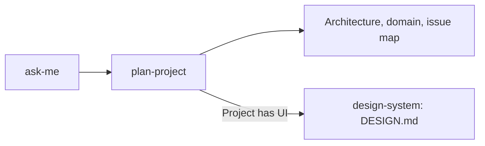
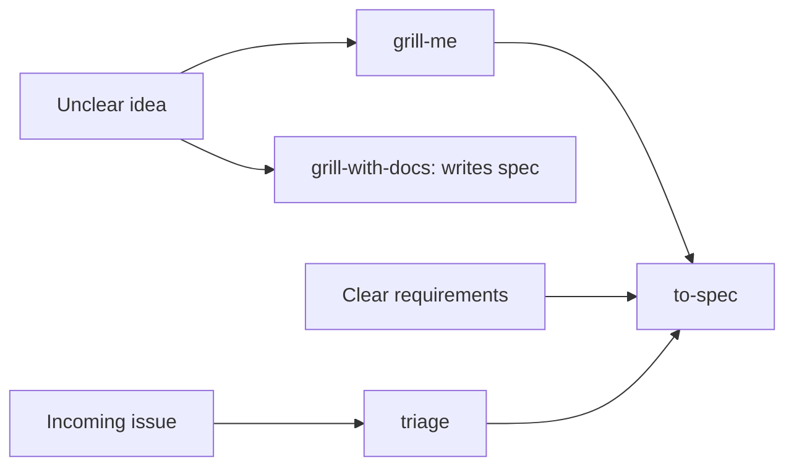
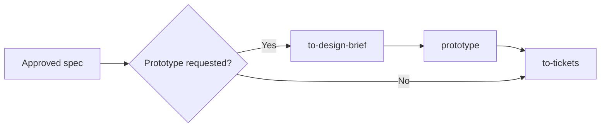
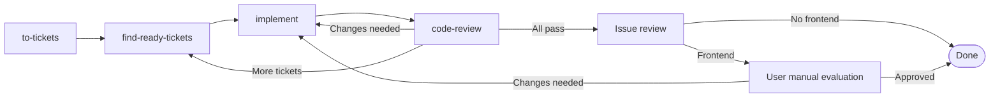

# Skills

Engineering skills for turning a project idea or existing codebase into planned, designed, ticketed, implemented, and reviewed software. The package is a collection of agent instructions: no runtime, build step, or framework is required.

```sh
npx skills add NickDabizaz/skills
```

Choose the skills and agent in the installer. Install all 17 for the full workflow; a selective install also needs the supporting skills called by its chosen entry points. This repository keeps one source tree at [`skills/engineering/`](skills/engineering/). The installer places selected skills in the directory used by the selected agent.

## Start here

Run `/ask-me` when you are unsure what to do next. For a new product or an existing repository without project context, begin with `/plan-project`. It inspects what exists, helps settle the application boundaries, stack, infrastructure, modules, data model, and issue tracker, and writes the project's agent-facing context. It plans the foundation; implementation happens through tickets.

```text
/plan-project  A customer portal and internal operations app sharing one database
/grill-with-docs  Add customer invitation to the account module
/to-tickets  .workspace/issues/customer-invitation/spec.md
/find-ready-tickets
/implement  .workspace/issues/customer-invitation/tickets/01-backend-invitation.md
```

Use `/grill-me` when you want to settle a change in conversation first. It offers `/to-spec` when the decisions are complete. Use `/grill-with-docs` when you want that interview to update project/domain docs and write the issue spec directly. A clear existing plan can go straight to `/to-spec`.

Every skill ends by reporting its result and offering the next relevant step. An offer does not silently run a user-invoked skill; if a decision is missing, the skill names the blocker instead.

## The flow

### 1. Plan the project


```mermaid
flowchart LR
    A["ask-me"] --> P["plan-project"]
    P --> C["Architecture, domain, issue map"]
    P -->|Project has UI| D["design-system: DESIGN.md"]
```

### 2. Define an issue


```mermaid
flowchart LR
    U["Unclear idea"] --> G["grill-me"] --> S["to-spec"]
    U --> GD["grill-with-docs: writes spec"]
    C["Clear requirements"] --> S
    I["Incoming issue"] --> T["triage"] --> S
```

`grilling` guides the interviews; `domain-modeling` keeps shared terms and rules consistent. For a bug with an unknown cause, `triage` can call `diagnosing-bugs` before the spec is written.

### 3. Design and divide the work


```mermaid
flowchart LR
    S["Approved spec"] --> Q{"Prototype requested?"}
    Q -->|Yes| B["to-design-brief"] --> P["prototype"] --> T["to-tickets"]
    Q -->|No| T
```

The prototype uses `DESIGN.md` and becomes the visual baseline only after approval.

### 4. Build and accept


```mermaid
flowchart LR
    T["to-tickets"] --> F["find-ready-tickets"] --> I["implement"]
    I --> R["code-review"]
    R -->|Changes needed| I
    R -->|More tickets| F
    R -->|All pass| A["Issue review"]
    A -->|Frontend| M["User manual evaluation"]
    A -->|No frontend| D(["Done"])
    M -->|Approved| D
    M -->|Changes needed| I
```

`tdd` handles automated scenarios the user selected. `code-review` checks every ticket and the completed issue; it can also review an existing change directly.

## Skills

| Skill | Invoked by | What it produces or checks |
| --- | --- | --- |
| `ask-me` | User | One recommended next skill |
| `plan-project` | User | Project architecture, context, tracker choice, and UI design if needed |
| `grill-me` | User | Settled decisions in the conversation |
| `grill-with-docs` | User | Settled decisions, updated domain context, and `spec.md` |
| `triage` | User | Verified issue category, state, and next action |
| `to-spec` | User | Detailed spec from already clear requirements |
| `to-design-brief` | User | Screen-by-screen contract for a requested prototype |
| `to-tickets` | User | Work-owned tickets and blocking dependencies |
| `find-ready-tickets` | User | Unblocked tickets available now |
| `implement` | User | Ticket implementation, agreed checks, and review handoff |
| `grilling` | Agent or user | One-decision-at-a-time interview discipline |
| `domain-modeling` | Agent or user | Consistent terms, invariants, and durable decisions |
| `design-system` | Agent or user | `.workspace/DESIGN.md` before UI briefs and prototypes |
| `prototype` | Agent or user | Inspectable UI baseline requested by the user |
| `tdd` | Agent or user | Red-green-refactor for selected automated scenarios |
| `code-review` | Agent or user | Ticket and whole-issue findings, evidence, and manual guide |
| `diagnosing-bugs` | Agent or user | Verified root cause and regression scenario |

User-invoked skills are explicit entry points. Supporting skills can be called by an agent as part of a workflow or requested directly by a user. The source of every skill is in `skills/engineering/<name>/SKILL.md`.

## Project files and issue tracking

`/plan-project` creates short root `AGENTS.md` and `CLAUDE.md` files that point to `CONTEXT.md`. `CONTEXT.md` is the map to the detailed `.workspace/` records:

```text
AGENTS.md
CLAUDE.md
CONTEXT.md
.workspace/
  ARCHITECTURE.md
  DOMAIN.md
  DESIGN.md                    # when the project has UI
  apps/<app-slug>.md            # only for app-specific differences
  issues/README.md             # planned outcomes and dependencies
  issues/<issue-slug>/
    spec.md
    design-brief.md            # when a prototype is requested
    prototype/                 # approved baseline, if any
    tickets/                   # Markdown tickets or a GitHub link index
```

Planning covers the project's purpose, application inventory, mono- or multi-repo choice, stack, infrastructure target, module rules, folders, initial database schema, and migration approach. Individual issue specs define the affected pages, endpoints, behavior, data changes, acceptance criteria, and test scenarios. An issue should be small enough to deliver an observable part of a module. Tickets split its work by backend, frontend, infrastructure, and testing only where each type has real work.

The project chooses a tracker during setup:

| Tracker | `.workspace/` in Git? | Ticket source of truth |
| --- | --- | --- |
| Local Markdown | No | One Markdown file per ticket under the issue's `tickets/` directory |
| GitHub Issues | Yes | GitHub issue body and status; local `tickets/` holds links only |

With GitHub, the tracked workspace can make specs and design references available across machines after those changes are committed and pushed. The skills do not silently commit or push. Never put credentials or secrets in tracked documents. Local tracker state is private to the local checkout unless the user shares it separately.

All skill instructions and file identifiers are English. The prose of issue specs, tickets, design briefs, and manual evaluation guides follows the user's input language.

## Design and testing decisions

For UI projects, `DESIGN.md` comes before a design brief or prototype. A small color or size change needs no prototype. When a layout changes, the agent offers one; the user decides. An approved prototype becomes the baseline for the screens, states, and viewports recorded in the spec. Implementation follows that baseline unless the user requests a deviation.

Before tickets are written, backend work always offers unit tests and frontend work always offers browser automation, with concrete use cases. The user may decline either. The spec records the choice, scenario setup, action, expected result, test level, and evidence. Browser automation may use Playwright; it is a recommendation, not a mandatory dependency. Selected automated scenarios can use `tdd` during implementation.

Every implementation ticket receives `code-review`. When all tickets pass, an issue-level review checks integration and the spec as a whole. For frontend work, the agent gives the user a manual guide listing the page, action, expected result, and prototype comparison. The issue stays open until the user approves that evaluation.

## Source and contribution

Add or change a skill in `skills/engineering/`, keep its English `SKILL.md` and `agents/openai.yaml` consistent, and update the routing table in `ask-me` plus this README when the user-facing set changes. No commit or push is performed automatically by these skills.

The folder layout and user/model invocation split take inspiration from [Matt Pocock's skills](https://github.com/mattpocock/skills); the workflow and artifact contracts here follow this package's own requirements.
